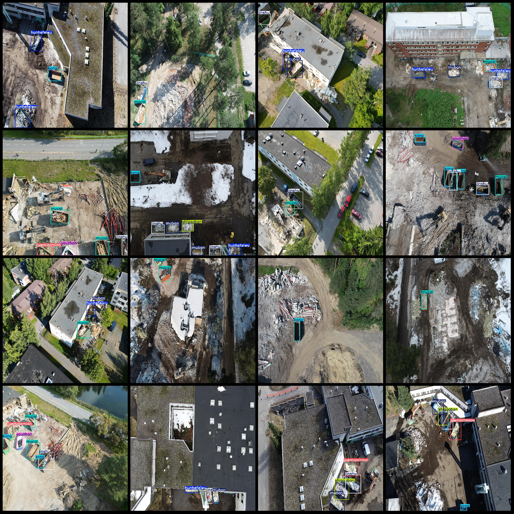
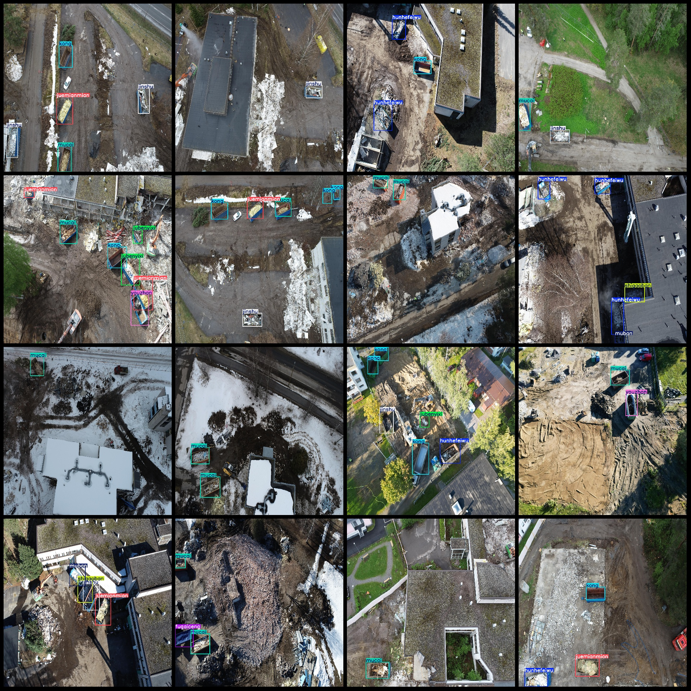

# Drone-Viewpoint Waste Detection Dataset in VOC+YOLO format with 3382 images and 12 categories

Dataset format: Pascal VOC format + YOLO format (txt files without split paths, only containing jpg images and corresponding VOC format xml files and yolo format txt files)
Number of images (jpg file count): 3382
Number of annotations (xml file count): 3382
Number of annotations (txt file count): 3382
Number of categories: 12
Category names in the annotation files: ["", "", "", "", "", "", "", "", "", "", "", ""]
Corresponding Chinese category names: ["1. ", "2. ", "3. ", "4. ", "5. ", "6. ", "7. ", "8. ", "9. ", "10. ", "11. ", "12. "]
Box counts for each category:
dianzilaji box count = 119
fugaiceng box count = 331
hunhefeiwu box count = 1727
jinshu box count = 2066
jubenyixi box count = 582
juemianmian box count = 601
kong box count = 1755
Number of frames = 4
Number of muban frames = 825
Number of mucai frames = 2719
Number of shegaoban frames = 290
Number of youzhan frames = 371
Total frame count: 11390
Number of images per category:
Dianzilaji image count = 119
Fujiancheng image count = 253
Hunhefeiwu image count = 1512
Jinshu image count = 1836
Jubenyixi image count = 386
Jueminyan image count = 568
Kong image count = 1231
Lishi image count = 4
muban images = 742  
mucai images = 2056  
shigaoban images = 250  
youzhan images = 370  
image resolution: 2048x2048  
Use the annotation tool: labelImg
Annotation rules: Draw a rectangle around the class.
Important notes: The dataset does not have a separate training, validation, and test set to be divided.
Special statement: This dataset does not guarantee the accuracy of the trained model or weight files.
Image preview:
## Images

Here is a pay link on Stripe ( https://buy.stripe.com/3cs8yP7sY87d0vu9AB ). Please contact me lonlonago@foxmail.com after funding $89, and I will send you a complete data files , thank you!

